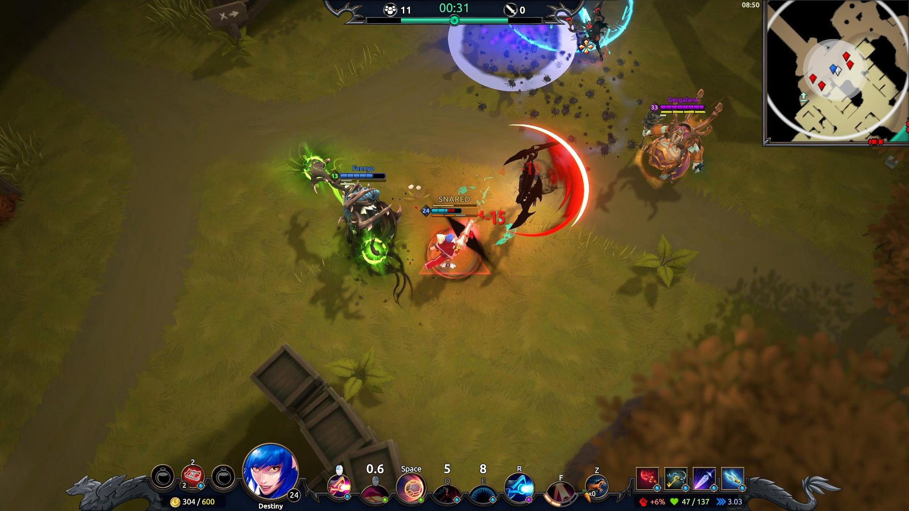

# GameProgramming2 Final

Game Name: Unknown Spirit   

Description Short: The Player has to survive against enemies that will try to kill you once they see you. Different weapons will be avaliable during the gameplay. For how long can you survive this challenge ? 

Description Long: The game will be passing on an arena, where it will be spawning different pop ups and the player can collect it to change his gun, for example: pistol, machine guns, rocket launchers and more. You have to survive as long as you can to achieve the highest score in the game. However, your guns have some limit amount of ammo and the waves will getting harder as it. Your character has the possibility to recover his health bar by collecting items during the gameplay, so if he got hit by one of the enemies, he still survive.   

Genre: Top-down shooting Game

Platform: Computer/Smartphone

Programmer: Angelo Casagrande de Mello

Images:

